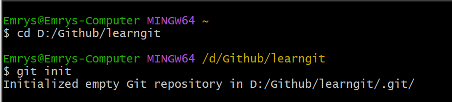
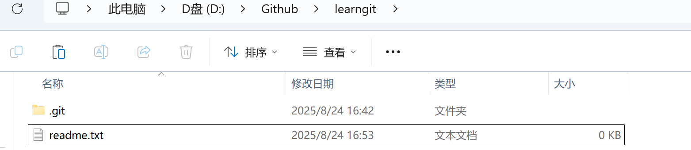

## 1. 如何处理应对手写数字识别项目

#### 明确目标

- 这个项目的最终要求是
- 输入一张手写数字图片，输出预测的数字

#### 分解问题

> 一个项目往往可以拆分为几个关键环节

1. 数据准备
   - 从哪里获取手写数字数据
   - 如何把图片转化为计算机能处理的形式
2. 观察探索数据
   - 数据是什么样的，什么特征，可以做什么处理
   - 可以挑几个样本进行分析
3. 大体上选择什么方法解决
   - 可以上网查资料
   - 问ai
   - 让别人引导你，不是直接给你答案
4. 实现与测试
   - 写代码实现分类功能
   - 拿一些数据测试，看看准确率
5. 改进
   - 如果效果不好，应该总结反思
   - 更换方法模型，思考为什么这个更好

#### 设计项目文件结构

- 一个项目处理的所有文件不能混在一起
- 应当养成分层次的习惯

例如这个项目可以如下设计

```bash
HandwrittenDigits/
│
├── data/             # 存放数据集
├── notebooks/        # Jupyter Notebook 用来探索数据
├── src/              # 代码（分类器、训练、预测等）
│   ├── data_utils.py
│   ├── models.py
│   └── train.py
├── Reflection/       # 项目的总结反思，存放tex以及pdf
└── README.md         # 项目说明

```

#### 规划学习路线

一个项目的完成不是我们一上手就什么都会的，

需要我们学中去做，做中去学，

比如这个项目，通过查资料我们其实大致可以知道要用什么方法，

然后我们就要去系统性学这一块的知识点


## 2. git代码管理

首先要知道，github仓库和我们的本地仓库其实是同等地位的，二者功能相同，github仓库就相当于一个远程git仓库，下面我们先抛开github，来谈git如何实现代码管理

**创建版本库**

- 将本地的目录变成git仓库



通过 `git init`，将这个目录变成Git可以管理的目录，即一个版本库，

它还告诉我们，这是一个空仓库，并且可以发现这个目录下多了一个 `.git` 文件夹，

这个文件夹就是用来跟踪管理版本库的

如果这个目录一开始不是空的，也是可以的，

我们就需要把这些**初始文件添加到版本库**

> 版本控制系统其实只能跟踪文本文件的改动，对于图像和word这些二进制的无法跟踪

故而接下来我们都以纯文本为例


把文件添加到版本库分为两步：

1. `git add`
2. `git commit`

我们先了解git版本库的几个概念

- 工作区
- 暂存区
- 本地仓库

工作区就是这个git版本库中除了.git的文件和文件夹



用以真实编辑操作的

而暂存区和本地仓库都是在.git文件夹里面

暂存区用来缓存你工作区进行的修改

本地仓库存放各个分支，各个分支通过时间把提交串联一条线，

至于什么是分支，后面再解释，默认创建一条main分支

那么暂存区怎么来跟踪修改，以及分支的提交是什么呢

就是 `git add`和 `git commit`


git add readme.txt，此命令告诉我要把这个文件的修改添加到暂存区，

新建一个文件也算一种修改，git的本质是管理修改

而git是怎么确定这个文件哪里修改了呢，通过最新的commit以及暂存区的记录来判断

将修改添加到暂存区后，还没有完成，

要git commit -m "wrote  a readme file" 来把文件提交到本地仓库，

`-m` 后面输入的是本次提交的说明，这样就能从历史记录中方便地找到改动记录


