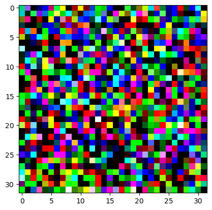

## 1. ai科研组的一些研究方向

### 1.1 开放环境机器学习（周志华教授）

#### Open-environment machine learning

模型面对的是 **动态、不确定、分布随时间变化的环境**。

可能遇到 **新任务、新类别、新数据分布**，这些在训练阶段并没有见过。

要求模型具备：

- **开放集识别（open set recognition）**：识别出“未知类别”而不是硬分类。
- **领域自适应 / 迁移学习**：适应新的数据分布。
- **增量学习 / 终身学习（continual learning）**：在不断变化的环境中学习，而不会遗忘旧知识。
- **鲁棒性**：对噪声、对抗攻击、环境变化要有一定抵抗能力。


#### Close-environment machine learning

- 假设 **训练数据和测试数据来自相同分布**（i.i.d. 假设）。
- 类别、任务、环境都是预先定义好的。
- 例如：在一个 MNIST 手写数字分类任务里，模型永远只会遇到 0–9 这 10 个数字。


#### Example

- **自动驾驶**：训练时的数据可能只有常见的道路标志和天气，但在实际驾驶中会遇到陌生标志、突发事件（如施工标志、极端天气）。
- **医疗诊断**：模型在某一医院数据上训练，但实际应用到另一医院时，患者群体分布、设备特征不同。
- **推荐系统**：用户兴趣随时间变化，新产品不断出现


### 1.2 Learnware（周志华教授）

“**Learnware**” 这个概念比较新，和软件（software）、硬件（hardware）相对。它的核心思想是：**把已经训练好的机器学习模型（或者学习能力）封装成一种可复用、可共享的“产品/服务单元”**


#### 基本定义

- **Software**：是程序和代码的集合。
- **Learnware**：是**已经学到的知识（模型、参数、特征提取器、学习机制）**的集合，可以像软件一样调用、组合和复用。

换句话说，**learnware 就是“会学习的智能模块”或“可迁移的学习成果”**。

#### 主要特点

1. **可重用性**：不同的任务/环境中可以直接调用已有的 learnware，而不必从零训练。
2. **抽象性**：不是简单的数据或程序，而是“经过训练的知识单元”。
3. **组合性**：多个 learnware 可以组合起来完成复杂任务。
4. **可迁移性**：能在新的任务或场景下进行适应（类似迁移学习）。


#### 举例

- 一个已经训练好的 **图像识别模型（如 ResNet 的特征提取部分）** 可以作为 learnware，别人直接调用它来做迁移学习。
- 一个 **机器翻译系统**（比如中译英模型），本身就可以作为一个 learnware 被调用。
- 一个 **推荐算法的 embedding 模块**，能直接嵌入到其他推荐系统里。


| 特性     | Software           | Learnware              |
| -------- | ------------------ | ---------------------- |
| 本质     | 人写的规则/程序    | 机器从数据中学到的知识 |
| 获取方式 | 编程实现           | 训练/学习              |
| 更新方式 | 人工维护、升级版本 | 持续学习、数据驱动     |
| 使用方式 | 按固定逻辑执行     | 可迁移、可适应新任务   |


### 1.3 人工智能中的知识表示与逻辑推理（赵一铮）

**研究主题**：

1. **逻辑形式主义**：DLs 作为形式语言（formal languages），用于精确刻画知识。
2. **自动推理**：利用逻辑系统进行有效推理，回答“某个知识是否可以从已知事实中推出”等问题。
3. **本体工程**：DL 是 OWL 等本体语言的逻辑基础，涉及语义网、知识图谱等。
4. **智能体建模**：涉及智能体的信念、意图、价值判断的逻辑表达。


### 1.4 资源受限的深度学习（张建鑫）

资源受限的深度学习就是在有限算力、存储、能耗等条件下，通过模型压缩、轻量化设计和系统优化，使深度学习模型依然能高效运行的研究与实践


## 2. 数分

$\lim\limits_{n\to+\infty}c_n\cdot n^3\tan(\sqrt11n\pi)$ 

$\sum\frac{1}{n^3\tan(\sqrt11n\pi)}$


## 3. handwriting_digit_recognition

#### 什么是 Tensor

- 张量

- 多维数组，类似于NumPy的 `ndarray`
- 用来存储数字、图片、音频

**Tensor 如何存储图片**


像素（`Pixel`) 是图片中的最小可见单位，

就如同拼图的每一块，每个像素都有对应的数值表示颜色或者亮度


先讲讲什么是灰度图，

每个像素只有一个数值，表示从黑到白的亮度，

数值范围：

- 传统图像：0~255，0=黑，255=白，中间是不同的灰色
- 转成 `Tensor` 后通常会归一化到 0~1

再聊聊彩色图，

通常是 `RGB`图，Red、Green、Blue

每个像素由三个数值组成，

- `[255,0,0]` → 纯红
- `[0,255,0]` → 纯绿
- `[0,0,255]` → 纯蓝
- `[128,128,128]` → 灰色


然后我们来说Tensor表示

灰度图：`[C, H, W] = [1, H, W]`

彩色图：`[C, H, W] = [3, H, W]`

- C=3 对应 RGB
- H, W 是高和宽


```python
import torch
img=torch.randn(3,32,32)
import matplotlib.pyplot as plt
img_show=img.permute(1,2,0)
plt.imshow(img_show)
plt.show()
```



#### 什么是 batch？

- Batch = 一次训练/预测中送进模型的一组样本
- 比如 MNIST 有 60,000 张训练图片，如果我们每次只训练 1 张，那效率太低了
- 所以我们把数据分成一组一组的“小包”，每个包就是一个 batch


## 4. CNN

