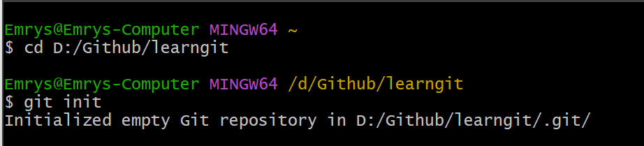

首先要知道，github仓库和我们的本地仓库其实是同等地位的，二者功能相同，github仓库就相当于一个远程git仓库，下面我们先抛开github，来谈git如何实现代码管理

**创建版本库**

- 将本地的目录变成git仓库

通过 `git init`，将这个目录变成Git可以管理的目录，即一个版本库，

它还告诉我们，这是一个空仓库，并且可以发现这个目录下多了一个 `.git` 文件夹，

这个文件夹就是用来跟踪管理版本库的

如果这个目录一开始不是空的，也是可以的，

我们就需要把这些**初始文件添加到版本库**

> 版本控制系统其实只能跟踪文本文件的改动，对于图像和word这些二进制的无法跟踪

故而接下来我们都以纯文本为例

把文件添加到版本库分为两步：

1. `git add`
2. `git commit`

我们先了解git版本库的几个概念

- 工作区
- 暂存区
- 本地仓库

工作区就是这个git版本库中除了.git的文件和文件夹

用以真实编辑操作的

而暂存区和本地仓库都是在.git文件夹里面

暂存区用来缓存你工作区进行的修改

本地仓库存放各个分支，各个分支通过时间把提交串联一条线，

至于什么是分支，后面再解释，默认创建一条main分支

那么暂存区怎么来跟踪修改，以及分支的提交是什么呢

就是 `git add`和 `git commit`

git add readme.txt，此命令告诉我要把这个文件的修改添加到暂存区，

新建一个文件也算一种修改，git的本质是管理修改

而git是怎么确定这个文件哪里修改了呢，通过最新的commit以及暂存区的记录来判断

将修改添加到暂存区后，还没有完成，

要git commit -m "wrote  a readme file" 来把文件提交到本地仓库，

`-m` 后面输入的是本次提交的说明，这样就能从历史记录中方便地找到改动记录

