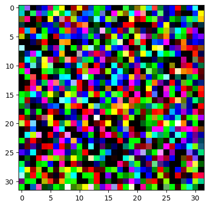

#### 什么是 Tensor

- 张量

- 多维数组，类似于NumPy的 `ndarray`
- 用来存储数字、图片、音频

**Tensor 如何存储图片**


像素（`Pixel`) 是图片中的最小可见单位，

就如同拼图的每一块，每个像素都有对应的数值表示颜色或者亮度


先讲讲什么是灰度图，

每个像素只有一个数值，表示从黑到白的亮度，

数值范围：

- 传统图像：0~255，0=黑，255=白，中间是不同的灰色
- 转成 `Tensor` 后通常会归一化到 0~1

再聊聊彩色图，

通常是 `RGB`图，Red、Green、Blue

每个像素由三个数值组成，

- `[255,0,0]` → 纯红
- `[0,255,0]` → 纯绿
- `[0,0,255]` → 纯蓝
- `[128,128,128]` → 灰色


然后我们来说Tensor表示

灰度图：`[C, H, W] = [1, H, W]`

彩色图：`[C, H, W] = [3, H, W]`

- C=3 对应 RGB
- H, W 是高和宽


```python
import torch
img=torch.randn(3,32,32)
import matplotlib.pyplot as plt
img_show=img.permute(1,2,0)
plt.imshow(img_show)
plt.show()
```



#### 什么是 batch？

- Batch = 一次训练/预测中送进模型的一组样本
- 比如 MNIST 有 60,000 张训练图片，如果我们每次只训练 1 张，那效率太低了
- 所以我们把数据分成一组一组的“小包”，每个包就是一个 batch